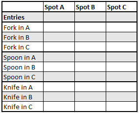
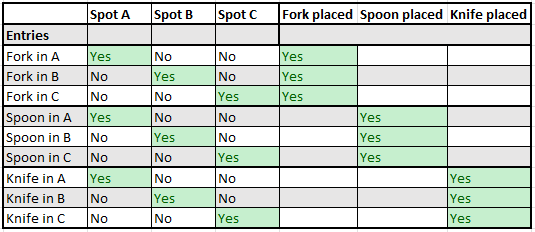

## Introduction

This project was an assignemnt during my Masters course at The University of Bath on February 2022.
Course: MSc Computer Science Module: Artificial Intelligence

The aim of the assignment is to construct a sudoku solver for 9x9 grid sudokus. The choice of algorithm was completely up to the developer.
Marks were awarded for the software's ability to solve different levels of hardness of sudokus as well as the speed of producing solutions

## Background

There are a number of different ways to approach this problem, the most common being backtracking and constraint propagation. I chose to use Donald Knuth's Algorithm X to solve the problem. This is a very efficient algorithm that uses a technique called dancing links to solve the problem. The algorithm is described in detail in the paper Dancing Links by Donald Knuth. To implement this algorithm, a sudoku is seen as an exact cover problem. 

### Exact cover problems

Before looking at the formal definition of an exact cover problem, let us attempt to understand the concept in plain english.

Imagine you are to to sort your cuttlery, a fork, a spoon and a knife each in a different spot in the drawer. Assume the 3 spots are names A, B and C
Each of the cuttleries must only occupy one of the spots - No spot shall have two items at any given time. There exist a number of possible solutions to this problem.
If we are to scale up the question to a set of 100 items and 100 spots then how are we to determine all possible configurations? This problem appears to be more complex as the number of
constraints has dramatically increased. The exact cover approach would go about solving this as such :
>1. Create a list of all constraints that are to be satisfied - List 1
>2. Create a list of potential ways to satisfy each of the constraints - List 2
>3. Consturct a matrix, with list 1 being the column headers and list 2 populating the values of the matrix.

_AndyG (2016) Solving Sudoku, Revisited_

Using the simple problem we have constructed the following table :

Since we cannot place all items at the same time, we require a constraint that states whether an item is placed or not. For all of the possible combinations of our simple problem, the matrix would look like this :\

The exact cover solution is to find a subset of the rows that satisfies all the constraints. That is, choose a set of rows that contain exactly one "Yes" in each column.\ In computers, the "Yes/No" is represented by "1" or "0". The rows that satisfy the constraints are called the "solutions" of the problem.\

Formally, an exact cover is defined as follows :
>Given a collection `S` of subsets of `X`, an exact cover is a subcollection `S*` of `S` such that each element in `X` is contained within exactly one subset in `S*`"\
It should satisfy the following conditions : 
>1) The Intersection of any two subsets in S* should be empty. That is, each element of X should be contained in at most one subset of S*
>2) The Union of all subsets in S* should be equal to X. That is, each element of X should be contained in at least one subset of S*\

_Kumar (2018, p1) Exact Cover Problem and Algorithm X_

In the context of sudoku, the collection `S` is the set of all possible rows, columns and boxes in a sudoku grid. The subsets of `X` are the possible values that can be placed in each cell of the grid. A sudoku is represented as a matrix with 729 rows and 324 columns. Each row represents a possible value for a cell in the grid. A representation of an exact cover matrix for a sudoku is shown [here](https://www.stolaf.edu/people/hansonr/sudoku/exactcovermatrix.htm).

The simplest way to solve an exact cover problem is to use a brute force approach. This is to try all possible combinations of rows in the matrix and check if they satisfy the constraints. This is a very inefficient approach as the number of possible combinations increases exponentially with the number of rows. The number of possible combinations is given by the product of the number of elements in each subset of `S`. In the case of sudoku, the number of possible combinations is 2^729. This is a very large number and is not feasible to compute. A more elegant way to approach this is to use algorithm X, described below.

### Algorithm X

Algorithm X is a recursive algorithm that solves the exact cover problem. A great in-depth explanation of the algorith can be found [here](https://en.wikipedia.org/wiki/Knuth%27s_Algorithm_X). The goal is to select a subset of the rows such that the digit 1 appears in each column exactly once.

The algorith functions as:

>0) If the matrix is empty, the problem is solved, return the solution
>1) Select a column `c` deterministically.
>2) Choose a row `r` such that `A[r][c] = 1`.
>3) Include `r` in the partial solution.
>4) For each column `j` such that `A[r][j] = 1`, \
  &nbsp;&nbsp;&nbsp;&nbsp;for each row `i` such that `A[i][j] = 1`, \
  &nbsp;&nbsp;&nbsp;&nbsp;&nbsp;&nbsp;&nbsp;&nbsp;&nbsp;delete row `i` from matrix. \
  &nbsp;&nbsp;&nbsp;&nbsp;delete column `j` from matrix.
>5) Repeat this algorithm recursively on the reduced matrix.

_Knuth's (2000, p.4) Algorithm X_

While any systematic rule to choose column `c` would will yield all solutions, Knuth suggested that the selection of column `c` would be made by selecting the column with the smallest number of 1s. This is a good heuristic as it reduces the number of recursive calls. This is because the number of 1s in a column is the number of rows that can be included in the solution. The fewer the number of rows, the fewer the number of recursive calls.

## Implementation

The implementation of the algorithm is done in Python. We require a way to use implement both the algorithm aswell as backtracking, therefore a class is created to represent a sudoku. The class has the following attributes :
>1) `matrix` : A 9x9 matrix representing the sudoku grid
>2) `rows` : A list of all rows in the sudoku
>3) `columns` : A list of all columns in the sudoku
>4) `boxes` : A list of all boxes in the sudoku
>5) `units` : A list of all units in the sudoku
>6) `solutions` : A list of all solutions to the sudoku

The class also has the following methods :
>1) `__init__` : The constructor for the class. Takes in a 9x9 matrix as input and creates the rows, columns, boxes and units.
>2) `get_row` : Returns the row at the specified index
>3) `get_column` : Returns the column at the specified index
>4) `get_box` : Returns the box at the specified index
>5) `get_unit` : Returns the unit at the specified index
>6) `get_units` : Returns a list of all units that contain the specified cell
>7) `pick_min` : Returns the column with the smallest number of 1s (condition of algorithm Step 1)
>8) `is_final` : Returns True if the sudoku has no more constraints to choose from, False otherwise
>9) `remove_constraints` : Application of algorithm Step 4
>10) `undo_remove` : Reverts the changes made by `remove_constraints`
>11) `add_solution` :  Add the given key (row column cell combo) to solutions, and remove associated keys from matrix
>12) `remove_solution` : Remove the given key (row column cell combo) from solutions, and restores associated keys to matrix
>13) `apply` : Applies the solution set to initial `values`, returns the values

Finally we have used two other methods to solve a sudoku
>1) `sudoku_solver` : The main function that solves the sudoku.
>2) `backtrack` : This method is a helper function for `sudoku_solver`. It is used to backtrack if the sudoku is unsolvable. By taking a key, it tests whether the sudoku will lead to a goal state, and if not, any changes made to the state (the sudoku object) will be reverted

## References
Knuth, D. 2000. Dancing Links. Millenial Perspectives in Computer Science, 2000, 187--214, Knuth migration 11/2004, pp 4-5.

Anon, Algorithm X in 30 lines! [Online] Available at: https://www.cs.mcgill.ca/~aassaf9/python/algorithm_x.html [Accessed 06 September 2022]. 

Anon, St. Olaf College. [Online] Available at: https://www.stolaf.edu/people/hansonr/sudoku/exactcovermatrix.htm [Accessed 08 September 2022]. 

Anon, 2022. Knuth's Algorithm X. Wikipedia. [Online] Available at: https://en.wikipedia.org/wiki/Knuth%27s_Algorithm_X [Accessed 06 September 2022]. 

Kumar, A. 2018. Exact Cover Problem and Algorithm X | Set 1 [Online] Available from: https://www.geeksforgeeks.org/exact-cover-problem-algorithm-x-set-1/ [Accessed 07 September 2022].

G, Andy. 2011. Solving Sudoku, Revisited [Online]. Andy G's Blog. Available from: https://gieseanw.wordpress.com/2011/06/16/solving-sudoku-revisited/ [Accessed 07 September 2021]

